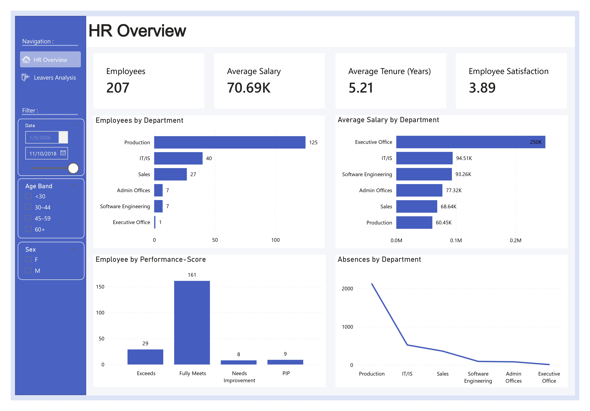
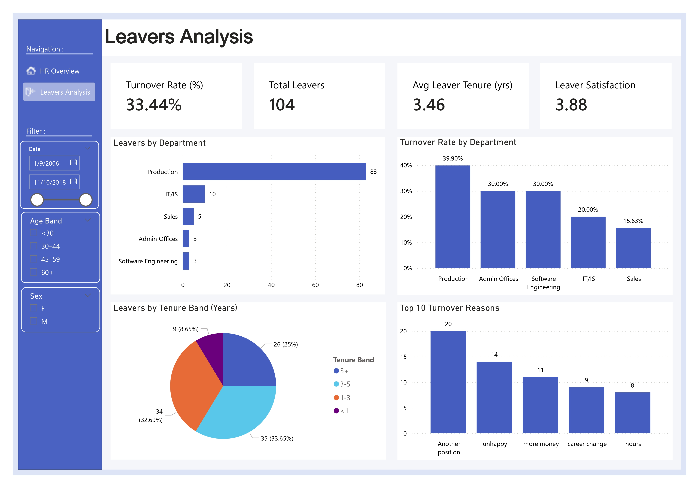

# HR Analytics & Employee Turnover Dashboard

## Project Overview

This project analyzes HR data to provide insights into workforce structure, employee performance, compensation, absenteeism, and turnover trends.

The goal was to build an interactive dashboard that supports HR decision-making and employee retention strategies.

## Business Objectives

1. Analyze workforce distribution across departments.
2. Monitor employee performance and satisfaction.
3. Identify turnover rate and high-risk departments.
4. Understand key drivers of employee attrition.
5. Support HR retention strategies through data insights.

## Project Workflow

1. HR dataset exploration and quality assessment  
2. Data cleaning and transformation within Power BI (Power Query)  
3. Data modeling and relationship creation in Power BI  
4. KPI definition and DAX measure development  
5. Turnover and attrition metric calculation  
6. Workforce segmentation (department, tenure, age band, gender)  
7. Interactive dashboard design and business storytelling
   
## Tools Used

- Power BI
- DAX for KPI calculations
- Data modeling within Power BI

## Data Modeling & Preparation

The original dataset was provided as a single flat file.

To improve analytical performance and model scalability, the data was transformed and normalized within Power BI into multiple structured tables, including:

- FactEmployee
- DimEmployee
- DimDepartment
- DimDate
- DimPerformance
- DimGender
- (other dimension tables as applicable)

Key steps:
- Data cleaning and standardization
- Column transformation and calculated fields
- Table separation and normalization
- Relationship creation between fact and dimension tables
- Time-based modeling using a Date dimension

## Power BI Dashboard

### HR Overview
- Total Employees
- Average Salary
- Average Tenure
- Employee Satisfaction
- Employees by Department
- Performance Distribution
- Absences Analysis

### Leavers Analysis
- Turnover Rate (%)
- Total Leavers
- Average Leaver Tenure
- Turnover Rate by Department
- Leavers by Tenure Band
- Top Turnover Reasons

## Key Insights

- Production department shows the highest turnover rate.
- Majority of leavers have tenure between 1–3 years.
- Compensation and internal mobility are major drivers of attrition.
- High absenteeism is concentrated in specific departments.

## DAX Examples (Key Measures)

### Active Employees
```DAX
Active Employees = 
VAR StartDate = MIN ( DimDate[Date] )
VAR EndDate   = MAX ( DimDate[Date] )
RETURN
CALCULATE (
    DISTINCTCOUNT ( FactEmployee[EmpID] ),
    FactEmployee[DateofHire] <= EndDate,
    FactEmployee[DateofHire]>=StartDate,
    FactEmployee[Termd]=0
)
```
### Terminated Employees
```DAX
Terminated Employees = 
VAR StartDate = MIN ( DimDate[Date] )
VAR EndDate   = MAX ( DimDate[Date] )
RETURN
CALCULATE (
    DISTINCTCOUNT ( FactEmployee[EmpID] ),
    FactEmployee[DateofTermination] <= EndDate,
    FactEmployee[DateofTermination]>=StartDate
)
```
### Turnover Rate (%)
```DAX
Turnover Rate (%) =
Divide(
[Terminated Employees]/[Total Employees])
```
### Average Tenure of Active Employees (Hired in Period)
```DAX
Average Tenure (Years) = 
VAR StartDate = MIN(DimDate[Date])
VAR EndDate = MAX(DimDate[Date])
RETURN
    AVERAGEX(
    FILTER(
        FactEmployee,
        FactEmployee[Termd] = 0
        && FactEmployee[DateofHire]<=EndDate
        && FactEmployee[DateofHire]>=StartDate
    ),
    DATEDIFF(
        FactEmployee[DateofHire],
        EndDate,
        DAY
    ) / 365.25
)
```
### Average Tenure of Leavers (Years)
```DAX
Avg Tenure of Leavers (Years) = 
VAR StartDate = MIN ( DimDate[Date] )
VAR EndDate   = MAX ( DimDate[Date] )
RETURN
AVERAGEX (
    FILTER (
        FactEmployee,
        NOT ISBLANK ( FactEmployee[DateofTermination] )
            && FactEmployee[DateofTermination] >= StartDate
            && FactEmployee[DateofTermination] <= EndDate
            && NOT ISBLANK ( FactEmployee[DateofHire] )
    ),
    DIVIDE (
        DATEDIFF (
            FactEmployee[DateofHire],
            FactEmployee[DateofTermination],
            DAY
        ),
        365.25
    )
)
```
### Average Employee Satisfaction
```DAX
Average Employee Satisfaction = 
VAR d = MAX ( DimDate[Date] )
RETURN
AVERAGEX (
    FILTER (
        FactEmployee,
        FactEmployee[DateofHire] <= d
            && FactEmployee[Termd]=0
            && NOT ISBLANK ( FactEmployee[EmpSatisfaction] )
    ),
    FactEmployee[EmpSatisfaction]
)
```
### Absences – Employees Hired in Period
```DAX
Absences (employees present in period) = 
VAR StartDate = MIN ( DimDate[Date] )
VAR EndDate   = MAX ( DimDate[Date] )
RETURN
CALCULATE (
    SUM ( FactEmployee[Absences] ),
    FILTER (
        FactEmployee,
        FactEmployee[DateofHire] <= EndDate
            && FactEmployee[DateofHire] >= StartDate       
    )
)
```

## Dashboard Preview

### HR Overview


### Leavers Analysis


## Power BI File

The Power BI file (.pbix) is available upon request.

## Skills Demonstrated

- HR KPI design
- Workforce analytics
- Attrition analysis
- Department-level performance evaluation
- Business storytelling with dashboards
- Interactive filtering and segmentation

## Author

Mohamed Fakhri Ben Brahim  
Aspiring Data Analyst | Python | SQL | Power BI | DAX | Advanced Excel
